# [Create interactive dashboards on Watson Studio](https://developer.ibm.com/technologies/analytics/tutorials/create-interactive-dashboards-on-watson-studio/)

**Learning objectives**

_This tutorial is part of the [2021 Call for Code Global Challenge](https://developer.ibm.com/callforcode/)._

This is the first of a two part tutorial. After completing this one, you can learn more about using charts in data visualization by looking at the second tutorial, [Using plots and charts in data visualization](https://developer.ibm.com/tutorials/using-plots-and-charts-in-data-visualization)

Data visualization can help you translate data and metrics into interactive charts, graphs and other visual reports. It also provides functions that allow you to view structured data and query data via an SQL editor. Moreover, through personalized settings, data virtualization can help you view and analyze information and data--from multiple perspectives--to make data decisions and applications. The data visualization service is extended across IBM Watson Studio tools, including IBM SPSS Modeler and IBM Data Refinery (for both IBM Cloud and IBM Cloud Pak for Data).

- Link to the Tutorial - https://ibm.biz/DataVizLab  
- IBM Cloud Sign-up: https://ibm.biz/DataViz  
- Event recording: https://www.crowdcast.io/e/data-visualization  
- Slides: https://mridulrb.github.io/Visualising-Data-to-Generate-Interactive-Charts-Graphs-to-Discover-Insights/#/  
- Survey: https://ibm.biz/Bdfyei
- Streaming:
  1.  YouTube: https://youtu.be/tYp0kScssIg
  1. Twitch: https://twitch.tv/mridulrb

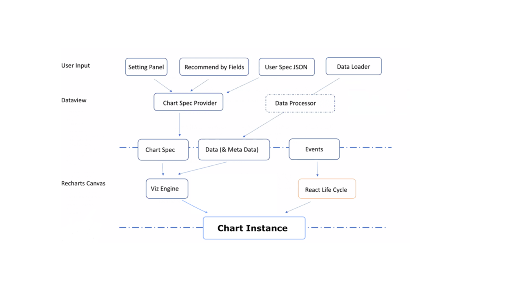
**Figure 1: Data visualization basic structure**

Input can be from the UI controls on the settings panel, recommended by fields, or the chart spec JSON script. All input will build valid chart spec via chart spec provider. Data Loader fetches data from the data visualization back-end service. Chart spec and loaded data will be as input of Viz Engine (Need to clarify). Data visualization builds react events based on the chart instance that will be be presented on browser.
 
The data visualization back-end service provides functions for loading data, computing statistic indicators, and generating images for big data.

## Estimated time

Completing this tutorial should take about 60 minutes.

## Steps

### Step 1: Navigation menu
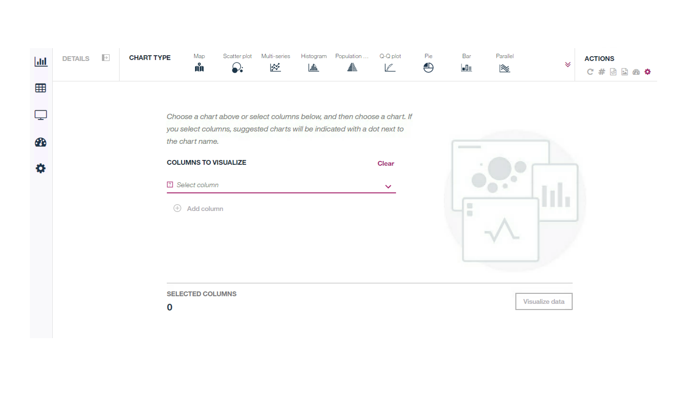
**Figure 2: Start over page**

Hover on the tool’s left icon, and you'll see the navigation menu shown below.

**Figure 3: Navigation menu**

#### Charts

The Chart tab allows you to create advanced data visualizations to explore the data from different perspectives and identify patterns, connections, and relationships within the data. Data visualization offers 28 types of charts, and you can switch between different charts as required. to get started, click the down arrow of **COLUMNS TO VISUALIZE** to select columns you want to work with. All suggested charts will be indicated with a red dot. You can click these charts to view the corresponding chart directly.

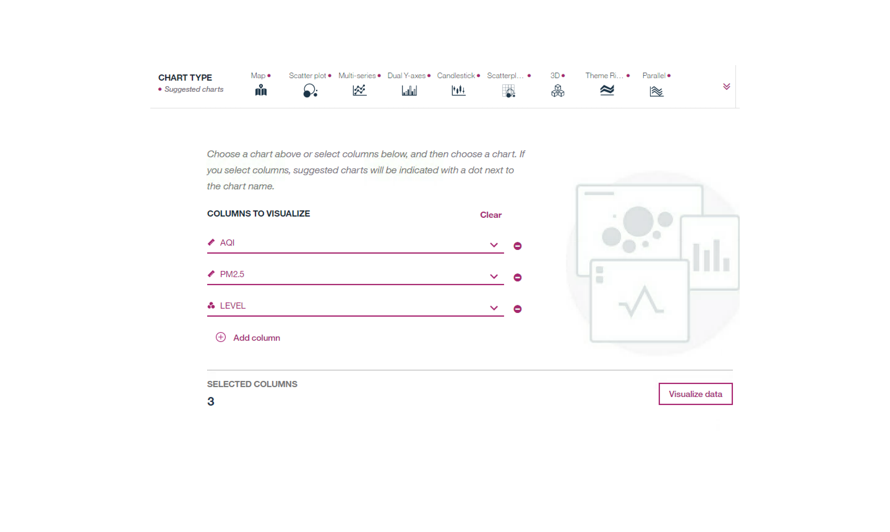
**Figure 4: The suggested charts**

To start, click on any chart from the selected charts. Click the **Visualize data** button to start from the first chart in Suggested charts list. Available chart types are ordered from most relevant to least relevant, based on the selected columns. If there are no columns in the data set with a data type, that is supported for a chart type, that chart will not be available. If a column’s data type is not supported for a chart, that column is not available to select for that chart. 

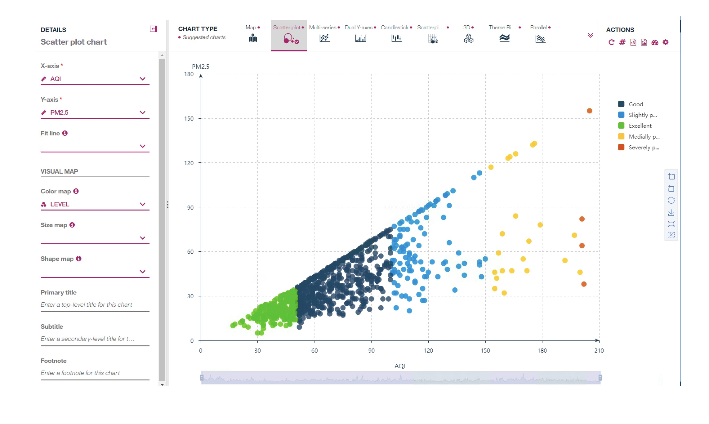
**Figure 5: Scatter plot chart**

Click Multi-series chart and the Multi-series chart will display. The figures below illustrate the columns that you've selected (in the Start over page) will be shared in each suggested chart. All shared columns can be applied into the suggested charts.

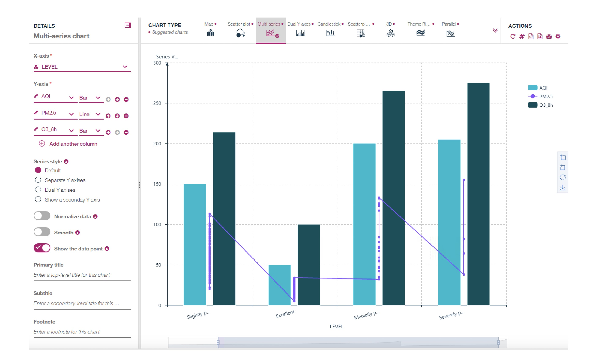
**Figure 6: Multi-series chart**

#### Spreadsheet

The Spreadsheet tab shows a read-only view of the selected data in table format. Open the Spreadsheet panel and the SQL Editor by click the SQL Editor bar at the bottom of the spreadsheet. Note: use the keyword ThisTable to refer the dataset in the spreadsheet. To edit the data, select the records where the AQI is bigger than 200 with the SQL **SELECT * FROM ThisTable where AQI>200**. For running the SQL, you'll need to click the button at the top-right corner of the SQL Editor.

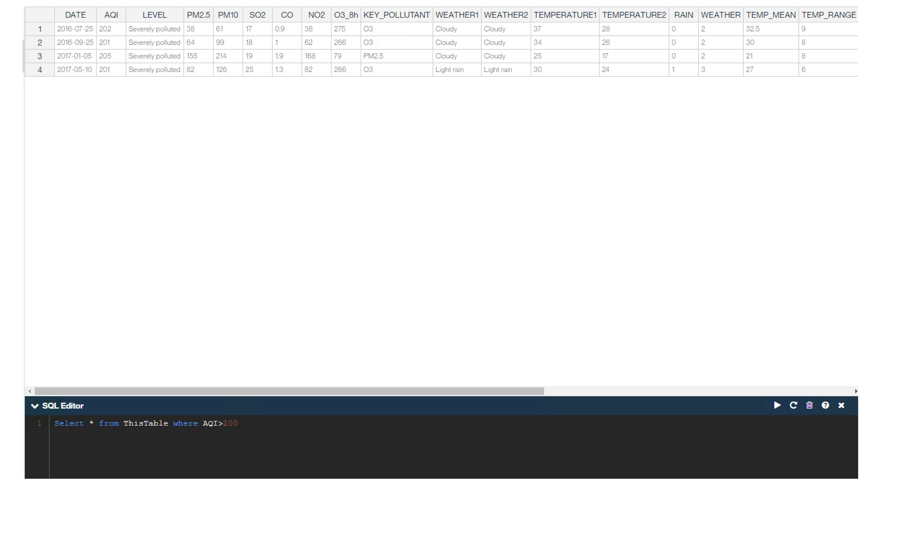
**Figure 7: SQL Editor 1**

The columns that are bigger than 200 display. Generate a new field whose value is PM10 – AQI with the SQL **SELECT * ,PM10 - AQI FROM ThisTable**

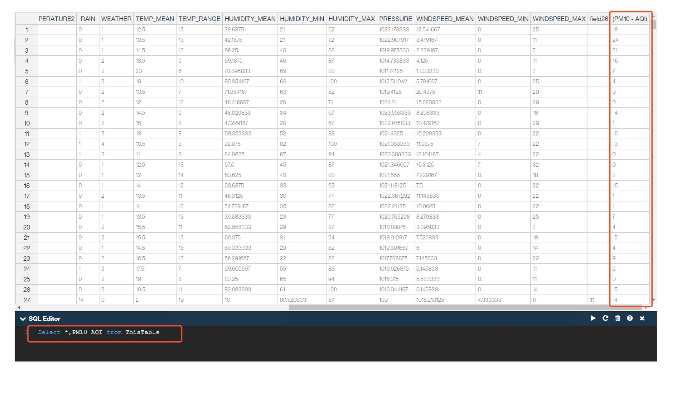
**Figure 8: SQL Editor 2**

In the last column, a new field will be generated named PM10 – AQI. And its value is equal to the value of PM10 minus the value of AQI. Of course, users can customize their data as they wish based on their familiarity with SQL statements.

#### Data Audit

The Data Audit tab shows the frequency and statistics for each column of the data. Open the Data Audit Panel. There are 4 tabs: Audit, Quality, Statistics, and Pearson Correlations.

##### Audit

The Audit tab shows the distribute graphs and the basic stats values of each field.

##### Quality

The Quality tab shows the quality of each field, including the outliers, extremes, and null values.

##### Statistics

The Statistics tab classifies the statistics of all the fields.

##### Pearson Correlations

The Pearson Correlations tab shows the relationship between every two fields. The correlation value between PM2.5 and PM10 is 0.963, meaning when PM2.5 value is large, PM10 value is also large. The correlation value between WINDSPEED_MEAN and AQI is -0.464. Therefore, they have a negative correlation.

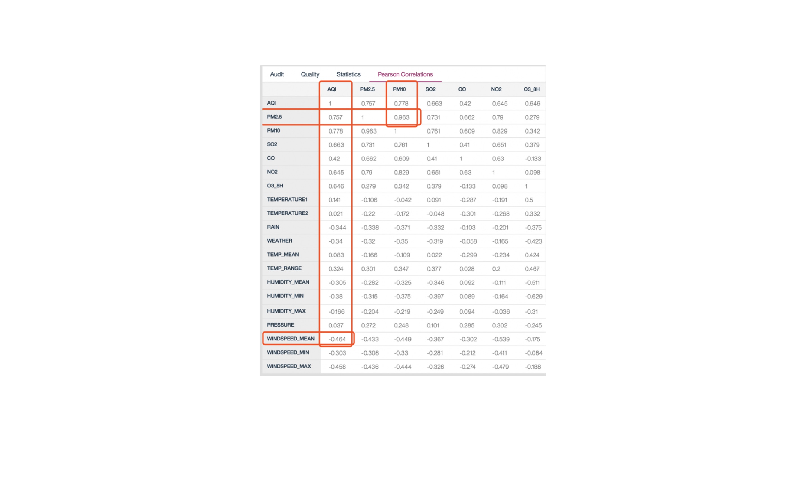
**Figure 9: Data Audit - Pearson correlations**

#### Dashboard

The Dashboard supports several pre-defined dashboards.  You can also add/edit the template or create a new layout template with ACTION toolbar items.

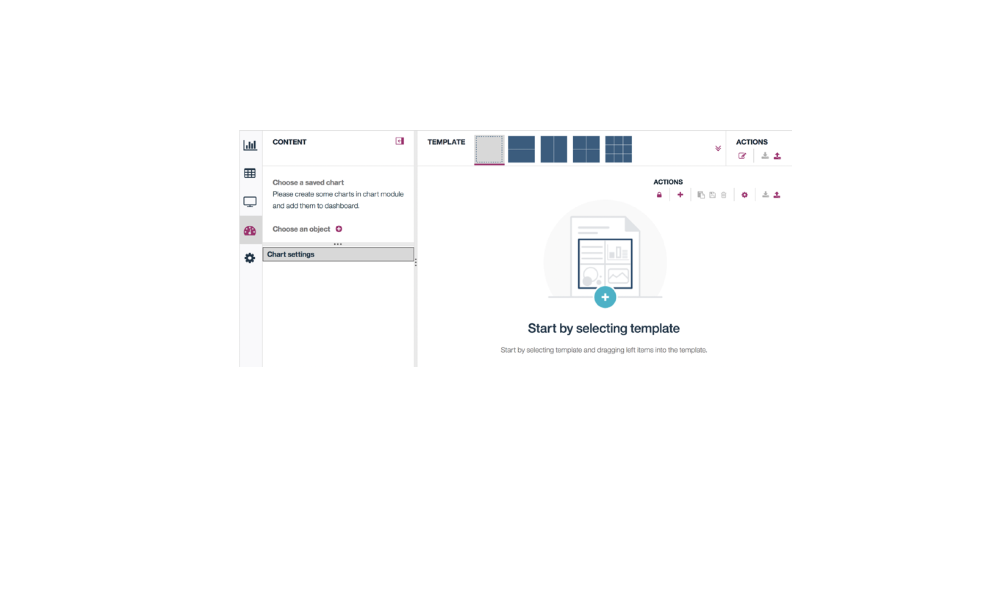
**Figure 10: Dashboard**

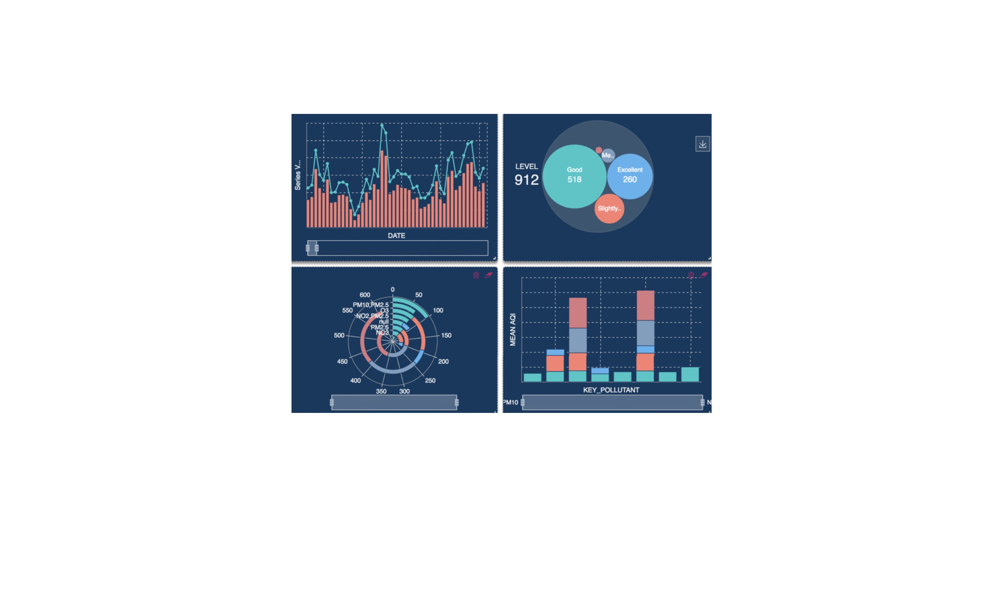
**Figure 11: Charts in dashboard**

#### Action toolbar items

##### Edit the layout/Leave layout edit mode

This mode allows you to enter or leave the layout edit mode. When entering edit mode, it allows you to create a small layout item and all items sizes can be dragged.

##### Add new item

This allows you to add a new layout item with 1 * 1 size. And by dragging the right corner, the layout item size can be adjusted.

##### Save

This allows you to save the edit layout as a template and overwrite current selected template. Note: the predefined template cannot be overwritten.

##### Save as a new template

You can also save the edit layout as a new template.

##### Remove

This allows you to remove the current selected template. Note: the predefined template cannot be removed.

##### Edit the layout unit settings

This allows you to define each unit's width and height pixel value.

##### Export template as a JSON file

This allows you to save the current layout and charts in the dashboard as a JSON file.

##### Import dashboard file

This allows you to upload a dashboard from a dashboard JSON file.

##### Choose a saved chart

This will show the chart list which is saved from the "Chart" module. Each one can be dragged into the dashboard layout item.

##### Choose an object

This will show you all dashboard objects which can be dragged into the dashboard layout item. It contains two types of objects: HTML text and image. Click the item's edit button to edit the object content.

##### Chart settings

By selecting a saved chart, the Chart settings grid will display to allow you to edit the settings. The edited chart will be changed according to the edits.

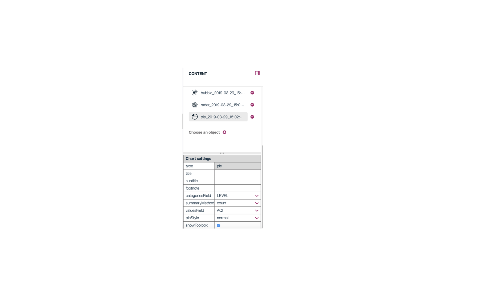
**Figure 12: Chart settings in dashboard**

#### Preferences

The Preferences tab allows you  to set interface preferences such as the language, and the look and feel. Data Visualization supports 12 languages (see below figure). If you need to switch to another language, select one of them, and the language will display as what as you pick.  Data Visualization provides 2 UI Skins, and 7 defined themes.

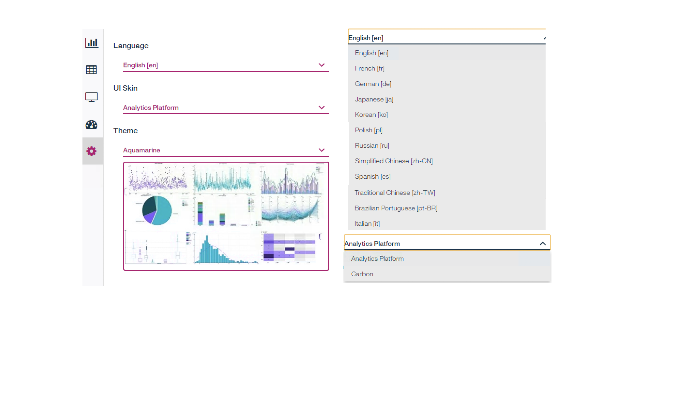
**Figure 13: Preferences**

### Step 2: Actions

At the upper right corner of the data visualization UI, there are some tool icons.

**Figure 14: Actions tools**

#### Start over

This allows you to switch to the start over page from the current chart.

#### Display data label/value in chart

This allows you to disaply label or value in the current chart.

#### Download chart details

You can download the current chart as a JSON file to save on your computer.

#### Download chart image

You can download the current chart as an image to save on yur computer.

#### Save as a dashboard chart

You can save the current chart as a dashboard chart.

The global visualization preferences allow you to set the chart title, turn on/off range slider, toolbox or other small tools, or change to different themes.  In a addition to the default theme, Data Visualization provides 7 different background themes to choose from.

### Step 3: Backend aggregation

To support large data, Data Visualization provides a “Backend aggregation” function. These charts can use aggregation data to present, instead of retrieving all the data.  For example: To present a pie chart of weather data, you only need to retrieve the aggregated data below.

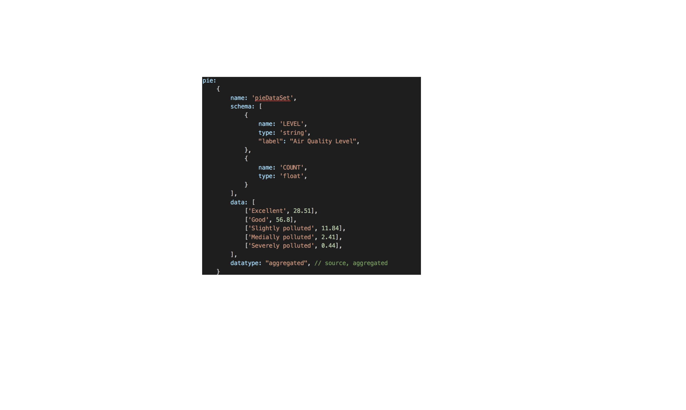
**Figure 15: Backend aggregation**

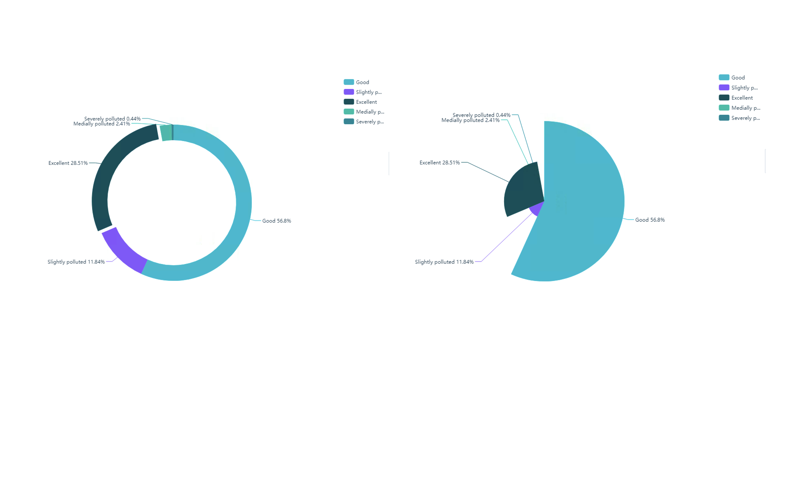
**Figure 16: Backend aggregation for pie chart**

The charts available to support backend aggregation include pie, bar, boxplot, histogram, bubble, circle packing, error bar, heat map, population pyramid, radar, sunburst, ThemeRiver, and word cloud.

### Step 4: Customized specification

All charts support the **Download chart details** function to save current chart specifications. You can paste chart specifications into a JSON script property of the Customized chart and click the **Generate Chart** button to the create your chart.

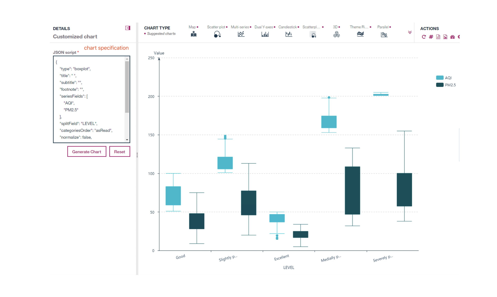
**Figure 17: Customized specification**

You can change the specification property to their expected value. If the specified property or value is not valid, a blank page with an error message will show. For example, if you set an invalid column name in the "seriesFields property" of the boxplot chart specification, an invalid column error message will show as image below.

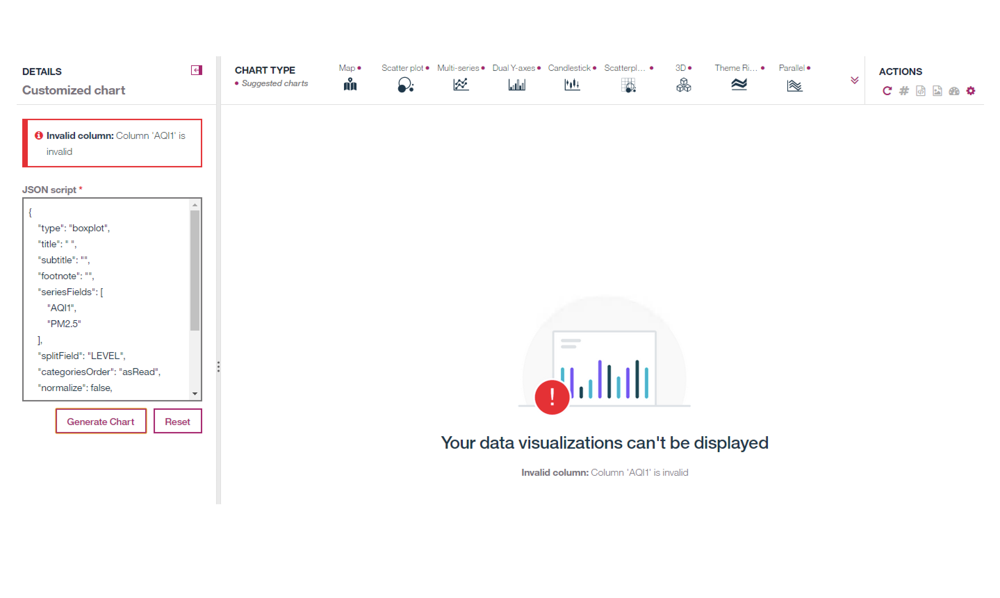
**Figure 18: Customized specification with error message**

## Summary

This tutorial covered data visualization and showed you some basic operations of each component, and also explained some common chart concepts and mechanisms. To learn more about using charts in data visualization, take a look at the next tutorial, [Using plots and charts in data visualization](https://developer.ibm.com/tutorials/using-plots-and-charts-in-data-visualization).
